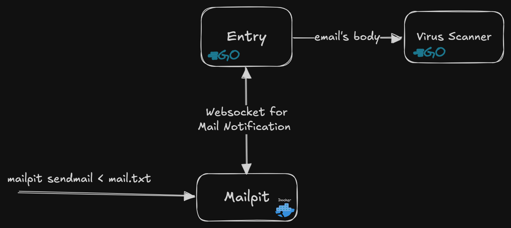

### How this work

1. run `docker compose up -d` to start the mock SMTP server
2. Start the server by running `go run main.go scanmail`
3. Test sending email by running `go run main.go sendmail` (this command will send 2 types of email, one with plain attachments and another with the attachments containing virus signature)
4. See the result in the terminal (WARN means virus detected)

