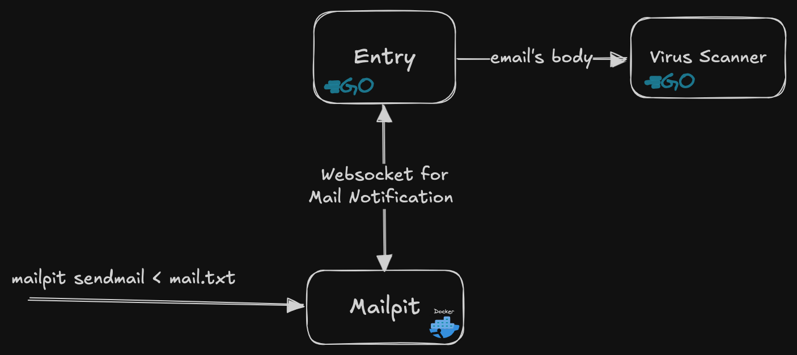

### TODO

From BB: the only left here is virus scanning logic which you can press ctrl+shift+f and type TODO

- [ ] virus-scanner package (Boom)
- [x] ~~_setup websocket for email notification (BB)_~~ [2025-03-15]
- [x] ~~_GetEmailFromID_~~ [2025-03-21]
- [x] ~~_Refactor Code_~~ [2025-03-21]

### Instruction (in progress)

1. run `docker compose up -d`
2. Start the server by run `go run main.go scanmail`
3. Test sending email by run `go run main.go sendmail`
4. See the result in terminal or go to http://localhost:8025 to view the mailpit's UI and the sent email

