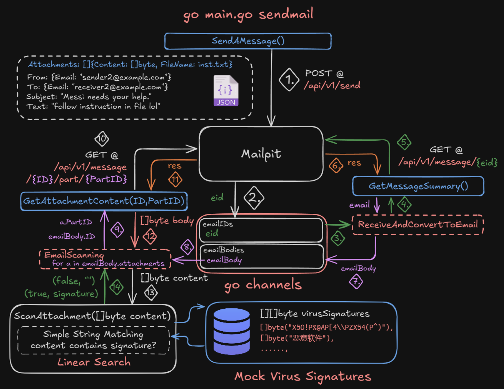

### Setup instruction

1. clone the repository
2. make sure your system has go and docker installed
3. run `docker compose up -d` to start the mock SMTP server
4. Start the server by running `go run main.go scanmail`
5. Test sending email by running `go run main.go sendmail` (this command will send 2 types of email, one with plain attachments and another with the attachments containing virus signature)
6. See the result in the terminal (WARN means virus detected)

#### Big Picture

#### Detailed Overview

